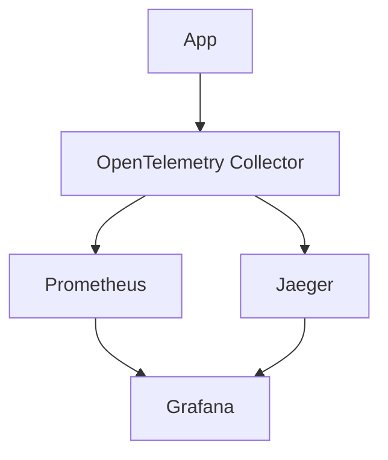

# OpenTelemetry + Jaeger + Prometheus + Grafana




## Getting Started

```shell
./gradlew clean build
```
```shell
docker compose up
```

## Grafana
- Access Grafana at `http://localhost:3000`

## Prometheus
- Access Prometheus UI at `http://localhost:9090`

## Jaeger
- Access Jaeger UI at `http://localhost:16686`

## OpenTelemetry Collector

### Ports
- 1888: pprof extension
- 8888: Prometheus metrics exposed by the collector
- 8889: 
- 13133: health_check extension 
- 4317: gRPC receiver
- 4318: HTTP receiver
- 55678: zpages extension