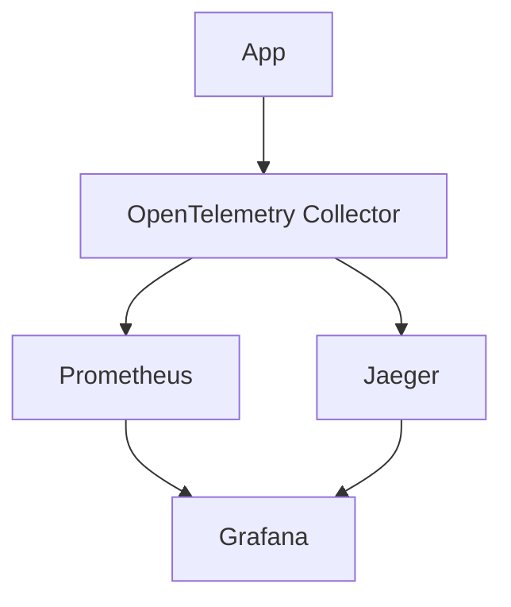

## OpenTelemetry + Jaeger + Prometheus + Grafana




### Getting Started

```shell
./gradlew clean build
```
```shell
docker compose up
```

### Grafana
- Access Grafana at `http://localhost:3000`

### Prometheus
- Access Prometheus UI at `http://localhost:9090`

### Jaeger
- Access Jaeger UI at `http://localhost:16686`